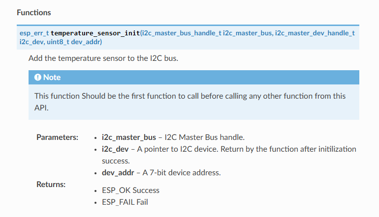

# API Documentation with Sphinx 
This guide shows how to generate API (or ESP-IDF components) documentation for an ESP-IDF project using **Doxygen** and **Sphinx** (with **Breathe** and the **Read the Docs** theme). You can apply the steps to any project you want to document. 

## Table of Contents
- [Tools Installation](#tools-installation)
- [Preparing Your APIs](#prepare-your-apis)
- [Start Documentation](#start-documentation)

## Tools Installation

- **Doxygen**
  
    Download and install the Doxygen from the Link below. 
  - Releases: <https://github.com/doxygen/doxygen/releases/tag/Release_1_14_0>
  

- **Sphinx**
```
  pip install sphinx
```
- **Breathe**
```
  pip install breathe
```
- **Read Doc Theme**
```
  pip install sphinx-rtd-theme
```

## Prepare Your APIs
For documentation, let’s say we have an ESP-IDF project with two components. Say we have two sensor components, i.e., a temperature sensor and a humidity sensor, in our IDF project.


To document these two snesors APIs, We have to add doxygen style comments in our API (or component) header file. During programming your APIs, you must add comments with your variables, classes, structures, Enums, and functions according to Doxygen syntax. Here is the sample comment and its generated output.
```
    /**
     * @brief Add the temperature sensor to the I2C bus.
     *
     * @param  i2c_master_bus     I2C Master Bus handle.
     * @param  i2c_dev            A pointer to I2C device. Return by the function after initilization success.
     * @param  dev_addr           A 7-bit device address.
     *
     * @note This function Should be the first function to call before calling any other function from this API.
     * @return
     *     - ESP_OK Success
     *     - ESP_FAIL Fail
     */
    esp_err_t temperature_sensor_init(i2c_master_bus_handle_t i2c_master_bus, i2c_master_dev_handle_t i2c_dev, uint8_t dev_addr);
```


 
## Start Documentation
At this point, we are considering that you have completed your APIs properly commented with Doxygen syntax.

Create a folder with name doc (or any name you want) in the IDF project folder.


### Doxygen Setup

Now open the terminal in this doc directory and enter the following command.
```
  doxygen -g doxygen_api_config
```
This command generates a Doxygen configuration template file with the provided name in the doc directory. You have to edit some of the parameters in this file. The Important ones are listed below. 

- INPUT = path to your APIs.
- OUTPUT_DIRECTORY = path where you want to place the generated Doxygen output.
- GENERATE_XML = YES
- RECURSIVE = YES

After editing the doxygen configuration file you are ready to create sphinx project. 
 
> [!NOTE]
> The INPUT and OUTPUT_DIRECTORY paths are the relative paths to the doc directory. In this repo, the INPUT path is the IDF components directory where all the APIs reside. So the path is `INPUT = ../components`. And `OUTPUT_DIRECTORY = doxygen_build`, means when you execute the doxygen command the generated output will be placed in `doxygen_build` directory.


### Sphinx Project Setup
In terminal enter the following command to start a sphinx project.
```
  sphinx-quickstart
```
And follow as shown below. You can set project name, author and release as you wish.

- Separate source and build directories (y/n) [n]: n
- Project name: api_doc
- Author name(s): ZeeMan
- Project release []: 1.0
- Project language [en]: en

After this command, you will get a template Sphinx project. Now you have to edit the project according to your needs. 

#### [Sphinx] Edit conf.py File

Edit or Add the following lines of code in the conf.py file
```
extensions = ['breathe']
breathe_projects = {"api_doc": "./doxygen_build/xml"}
html_theme = 'sphinx_rtd_theme'
```
> [!NOTE]
> `api_doc` is the project name and `./doxygen_build/xml` is the OUTPUT_DIRECTORY set earlier in the doxygen configuration file. Actually `doxygen_build` directory has multiple output directories. Here we need xml output only.

#### [Sphinx] Add reStructure Files
As we have two APIs (or components). Let's create two reStructure Files with names `temperature.rst` and `humidity.rst`. Now add the following code in these files respectively. 

```
Temperature Sensor
==================

.. doxygenfile:: temperature_sensor.h
	:project: api_doc
```
```
Humidity Sensor
===============

.. doxygenfile:: humidity_sensor.h
	:project: api_doc

```

> [!NOTE]
> `project` is the project name and `doxygenfile` is the API header file.

Finally edit the index.rst file (which is generated automatically by sphinx) with the following code.
```
Welcome to api_doc's documentation!
===================================

.. toctree::
   :maxdepth: 2
   :caption: API Reference:

   temperature
   humidity

```
> [!NOTE]
> Here `temperature` is the `temperature.rst` file and `humidity` is the `humidity.rst` file.

#### [Sphinx] Build Documentation
To Build documentation first enter: `doxygen doxygen_api_config`. Here `doxygen_api_config` is the doxygen configuration file. 

Then enter `make html`. Hurray here is your API document. You can find the index.html in `_build/html/index.html`


> [!TIP]
> You can use same steps to document your projects other than ESP-IDF. 


